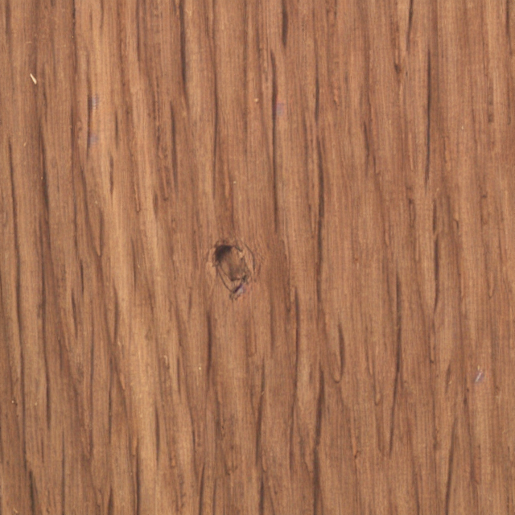

# Stable-diffusion-defect-generation
Previously [Stable Diffusion](https://github.com/runwayml/stable-diffusion) has great impact on image generation with supported unconditional and conditional generation. Especially, the conditional generation enpowers users to create specific types of "arts", manifesting a great bussiness potential to be discovered. Follow the work of Stable Diffusion, this repo shows a method to generate realistic texture defect with few defect samples, in our extreme case, only one sample is available.

(Code would be updated later)

# Method 
      

From left to right: defect sample, defect mask, non-defect image, generated defect image

Inspired by the text2img and inpainting applicaions from Stable Diffusion, my propose method follows:
1. Mask out the defect area and concat the defect mask as input, following the inpainting training schedule
2. Use the CLIP image encoder to extract features from defect area
3. Project the defect features to proper dimension and inject to the cross-attention in Latent Diffusion Model
4. Freeze the Encoder&Decoder(`AutoencoderKL` I use)
5. Train the stable diffusion
